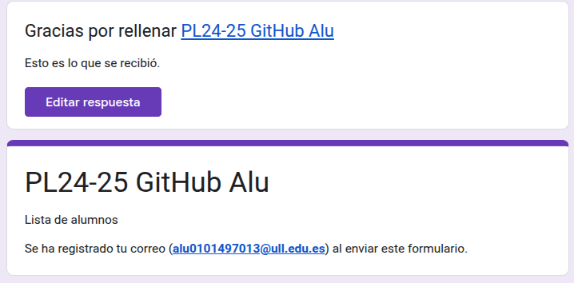
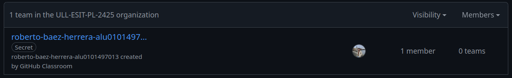
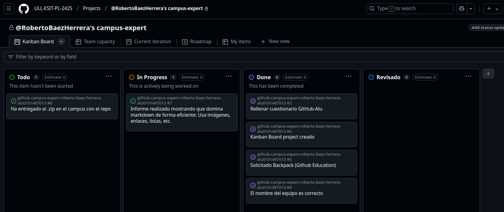

# Github Campus Expert 

- Roberto
- Báez Herrera
- alu0101497013

## Rellenado el cuestionario GitHub-Alu del campus virtual y recibir el correo confirmándolo

## Creado equipo con nombre correcto

## Creado un project board kanban para este repositorio

## Solicitado el GitHub Backpack

