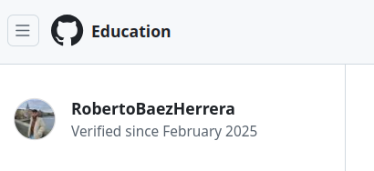

# Github Campus Expert 

- Roberto
- Báez Herrera
- [alu0101497013](https://campusingenieriaytecnologia2425.ull.es/user/view.php?id=24250901463&course=2425090148)

## Rellenado el cuestionario GitHub-Alu del campus virtual y recibir el correo confirmándolo

## Creado equipo con nombre correcto

## Creado un project board kanban para este repositorio

## Solicitado el GitHub Backpack

## Tareas realizadas
1. Rellenado cuestionario GitHub-Alu ✅
2. El nombre del equipo es correcto ✅
3. Solicitado Backpack ✅
4. Kanban Board project creado ✅
5. Informe realizado mostrando que domina markdown de forma eficiente: Usa imágenes, enlaces, listas, etc. ✅
6. Ha entregado el .zip en el campus con el repo ✅
